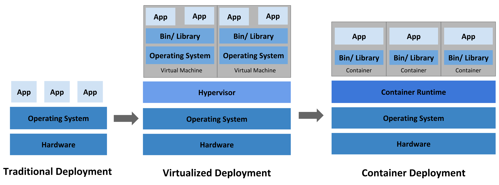

# foo

## 部署方式比较



**传统部署方式**

应用直接在物理机上部署，机器资源分配不好控制，出现 Bug 时，可能机器的大部分资源被某个应用占用，导致其他应用无法正常运行，无法做到应用隔离。

**虚拟机部署**

在单个物理机上运行多个虚拟机，每个虚拟机都是完整独立的系统，性能损耗大。

**容器部署**

所有容器共享主机的系统，轻量级的虚拟机，性能损耗小，资源隔离，CPU 和内存可按需分配

## K8S 架构


**Master**

主节点，控制平台，不需要很高性能，不跑任务，通常一个就行了，也可以开多个主节点来提高集群可用度。

**Worker**

工作节点，可以是虚拟机或物理计算机，任务都在这里跑，机器性能需要好点；通常都有很多个，可以不断加机器扩大集群；每个工作节点由主节点管理

**Pod**

豆荚，K8S 调度、管理的最小单位，一个 Pod 可以包含一个或多个容器，每个 Pod 有自己的虚拟 IP。一个工作节点可以有多个 pod，主节点会考量负载自动调度 pod 到哪个节点运行。

## 实现

```java
/**
 * 格式化数字为千分位表示
 *
 * @param value       数值，可为 String/六种数值类型/BigDecimal
 * @param fieldLength 保留的小数位数，为 null 时的默认规则：若 value 为 bigDecimal 则不进行设置，否则保留两位小数
 * @param delimiter   千分位分隔符，为空时默认为 ,
 * @return 格式化后的数据，比如 1,234,567.89
 */
public static String format(Object value, Integer fieldLength, String delimiter) {
    try {
        if (value == null) {
            throw new NullPointerException("数值不可为null");
        }

        BigDecimal bigDecimalVal;
        if (value instanceof BigDecimal) {
            bigDecimalVal = (BigDecimal) value;
            if (fieldLength != null) {
                bigDecimalVal = bigDecimalVal.setScale(fieldLength, RoundingMode.HALF_UP);
            }
        } else {
            bigDecimalVal = new BigDecimal(value.toString());
            if (fieldLength != null) {
                bigDecimalVal = bigDecimalVal.setScale(fieldLength, RoundingMode.HALF_UP);
            } else {
                bigDecimalVal = bigDecimalVal.setScale(2, RoundingMode.HALF_UP);
            }
        }

        if (!StringUtils.hasLength(delimiter)) {
            delimiter = ",";
        }

        NumberFormat instance = NumberFormat.getInstance();
        instance.setMinimumFractionDigits(bigDecimalVal.scale());
        String[] parts = instance.format(bigDecimalVal).split(",");
        StringBuilder res = new StringBuilder();
        for (int i = 0; i < parts.length; i++) {
            res.append(parts[i]);
            if (i != parts.length - 1) {
                res.append(delimiter);
            }
        }
        return res.toString();
    } catch (Exception e) {
        e.printStackTrace();
    }
}

```