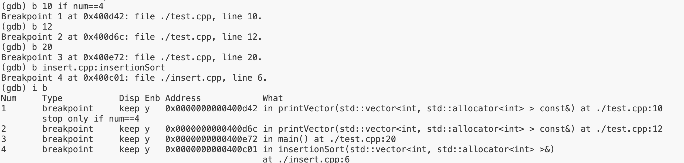

# GCC 入门

## GCC

### 介绍及安装

`gcc` 是 Linux 下的编译工具集，是 `GNU Compiler Collection` 的缩写，该工具集不仅包含 `gcc`、`g++` 等编译器，还包含其它工具集比如 `ar`、`nm` 等。

GCC 工具集不仅能编译 C/C++ 语言，其他例如 Objective-C、Pascal、Fortran、Java、Ada 等语言均能进行编译。GCC 在可以根据不同的硬件平台进行编译，既能进行**交叉编译**，即在 A 平台上编译 B 平台的程序，支持常见的 X86、ARM、PowerPC、mips 等，以及 Linux、Windows 等软件平台。

安装

```sh
gcc -v
g++ -v

sudo apt/yum update
sudo apt/yum install gcc g++
```

### 工作流程

GCC 编译器对程序的编译分为四个阶段：

1. 预处理：本阶段主要内容是**展开头文件**、**宏替换**和**去掉注释行**。这个阶段需要使用预处理器来完成，最终得到的还是文本格式的源文件
2. 编译：这个阶段需要调用编译器对文件进行编译，最终得到一个汇编文件
3. 汇编：这个阶段需要调用汇编器对文件进行汇编，最终得到一个二进制文件
4. 链接：这个阶段需要调用链接器链接程序调用的库，最终得到是一个可执行的二进制文件

| 文件后缀 | 说明                   | gcc 参数 |
| -------- | ---------------------- | -------- |
| `.c`     | 源文件                 | 无       |
| `.i`     | 预处理后的 c 文件      | `-E`     |
| `.s`     | 编译之后得到的汇编文件 | `-S`     |
| `.o`     | 汇编后得到的二进制文件 | `-c`     |

**示例：分阶段展示 GCC 工作步骤**

1、准备`main.c`

```c
#include <stdio.h>
#define NUMBER 3
int main() {
  int a = 10;
#ifdef DEBUG_MODE
  printf("我是一个程序猿，但不会爬树...\n");
#endif
  for (int i = 0; i < NUMBER; i++)
  {
    printf("Hello, GCC!!\n");
  }
  return 0;
}
```

2、预处理：`gcc -E main.c -o main.i`（`-o` 指定输出文件）

`main.i`

```c
# 1 "main.c"
# 1 "<built-in>"
# 1 "<command-line>"
# 31 "<command-line>"

....

# 2 "main.c" 2
# 3 "main.c"
int main() {
  int a = 10;


  for (int i = 0; i < 3; i++)
  {
    printf("Hello, GCC!!\n");
  }
  return 0;
}
```

3、汇编：`gcc -S main.i -o main.s`

`main.s` 内容为

```assembly
	.file	"main.c"
	.text
	.section	.rodata
.LC0:
	.string	"Hello, GCC!!"
	.text
	.globl	main
	.type	main, @function
main:
.LFB0:
	.cfi_startproc
	pushq	%rbp
	.cfi_def_cfa_offset 16
	.cfi_offset 6, -16
	movq	%rsp, %rbp
	.cfi_def_cfa_register 6
	subq	$16, %rsp
	movl	$10, -8(%rbp)
	movl	$0, -4(%rbp)
	jmp	.L2
.L3:
	movl	$.LC0, %edi
	call	puts
	addl	$1, -4(%rbp)
.L2:
	cmpl	$2, -4(%rbp)
	jle	.L3
	movl	$0, %eax
	leave
	.cfi_def_cfa 7, 8
	ret
	.cfi_endproc
.LFE0:
	.size	main, .-main
	.ident	"GCC: (GNU) 8.5.0 20210514 (Red Hat 8.5.0-4)"
	.section	.note.GNU-stack,"",@progbits
```

4、编译：`gcc -c main.s -o main.o`

获取的 `main.o` 为一个二进制文件

5、链接：`gcc main.o -o test`

获取到可执行文件 `test`，执行：`./test`

**示例：GCC 一步编译**

`gcc main.c -o app`（这一步相当于链接操作，之前的三步是自动完成的）

也可以简化为 `gcc main.c` 生成的可执行程序名为 `a.out`

### 常用参数

| 编译选项     | 描述                                                                                                                                     |
| ------------ | ---------------------------------------------------------------------------------------------------------------------------------------- |
| `-E`         | 预处理源文件。比如 `gcc -E main.c -o main.i`                                                                                             |
| `-S`         | 编译处理。如果指定 `.c` 文件时会自动进行预处理。<br />比如 `gcc -S main.i -o main.s`                                                     |
| `-c`         | 汇编处理。指定`.c`或`.i`或`.s`文件时会自动进行预处理和编译<br />比如 `gcc -c main.s -o main.o`                                           |
| `-o`         | 指定输出文件。有两种形式：<br />1、`-o target source` 比如 `gcc -E -o main.i main.c`<br />2、`source -o target` 比如 `gcc main.c -o app` |
| `-I`         | **指定** include 包含文件的**搜索目录**，不用手动在 `#include` 语句中指定路径                                                            |
| `-g`         | 指定该参数，在编译时会生成调试信息，可被调试器（gdb）调试                                                                                |
| `-D`         | 在程序编译时指定宏，比如 `gcc -o app main.c -DDEBUG_MODE`                                                                                |
| `-w`         | 不生成任何警告信息，不建议使用，因为有时候警告就是错误                                                                                   |
| `-Wall`      | 生成所有警告信息                                                                                                                         |
| `-On`        | 指定编译器优化的级别，`n` 的取值为 `0-3，`表示四个级别，<br />0 表示无优化，1 为默认值，3 优化级别最高                                   |
| `-l`         | 指定编译时使用的库                                                                                                                       |
| `-L`         | 指定编译时搜索的库路径                                                                                                                   |
| `-fPIC/fpic` | 生成与位置无关的代码                                                                                                                     |
| `-shared`    | 生成共享目标文件。通常用在建立共享库时                                                                                                   |
| `-std`       | 指定 C 方言，比如 `-std=c99`，gcc 默认方言是 `GNU C`                                                                                     |

### -I 指定头文件路径

起始项目：[gcc/02_include · Eugene/gcc_n_makefile - 码云 - 开源中国 (gitee.com)](https://gitee.com/egu0/gcc_n_makefile/tree/93c7a9c737570908cb35cc94d6b829979fd9d8cc/gcc/02_include)

```
.
├── add.c
├── div.c
├── head.h
├── main.c
├── mul.c
└── sub.c
```

编译：`gcc *.c`，获取到的 `a.out` 可通过 `./a.out` 执行

---

改变目录结构，将头文件放入 `include` 文件夹内

```
.
├── add.c
├── div.c
├── include
│   └── head.h
├── main.c
├── mul.c
└── sub.c
```

再次编译时出错

```
main.c:2:10: fatal error: head.h: No such file or directory
 #include "head.h"
          ^~~~~~~~
compilation terminated.
```

改进编译命令：`gcc *.c -I include/`，使用 `-I` 指定头文件搜索目录

> `-I include/` 也可以写为 `-Iinclude`，即参数和值之间不加空格

### -D 指定宏

如果不想在程序中定义宏，但想让它存在，可以使用 `-D` 参数，编译器会认为参数后边指定的宏是程序中存在的。

```c
#include <stdio.h>
#define NUMBER 3
int main() {
  int a = 10;
#ifdef DEBUG_MODE
  printf("我是一个程序猿，但不会爬树...\n");
#endif
  for (int i = 0; i < NUMBER; i++)
  {
    printf("Hello, GCC!!\n");
  }
  return 0;
}
```

编译：`gcc main.c -o main -DDEBUG_MODE`

> `-DDEBUG_MODE` 就是 `-D DEBUG_MODE`
>
> 也可以为宏指定数值，比如 `-DNUMBER=10`

```
[engure@ali 01_intro]$ ./main
我是一个程序猿，但不会爬树...
Hello, GCC!!
Hello, GCC!!
Hello, GCC!!
```

### gcc 与 g++ 的区别

gcc 和 g++ 都能编译 c 或 cpp 程序，只不过在某些特别的方面是有区别的

1. **编译阶段**： g++ 会调用 gcc，c 和 cpp 程序都由 gcc 编译。总之，gcc 和 g++ 都可以编译 c 和 cpp 代码。
2. **链接阶段**
   1. 对于 c 程序，gcc 和 g++ 都可以自动链接到标准 C 库
   2. 对于 cpp 程序，g++ 可以自动链接标准 C++ 库；如果需要使用 gcc 链接标准 C++ 库则需要添加`-lstdc++`参数
3. 关于 `__cplusplus` 宏的定义
   1. g++ 会自动定义该宏，但这个不影响它去编译 c 程序
   1. gcc 需要根据文件后缀判断是否要定义该宏

---

总结：

1. gcc 和 g++ 都可以编译 c 程序，编译程序的规则和参数都相同
2. g++ 可以编译 cpp 程序，gcc 编译 cpp 程序需要添加额外参数 `-lstdc++`
3. gcc 和 g++ 都可以定义 `__cplusplus` 宏

---

动手实践

```cpp
//a.cpp
#include <iostream>
using namespace std;
int main()
{
  cout << "hello world!" << endl;
  return 0;
}
```

```c
//test.c
#include <stdio.h>
#define NUMBER 3
int main() {
  int a = 10;
#ifdef DEBUG_MODE
  printf("我是一个程序猿，但不会爬树...\n");
  printf("%d\n", DEBUG_MODE);
#endif
  for (int i = 0; i < NUMBER; i++)
  {
    printf("Hello, GCC!!\n");
  }
  return 0;
}
```

使用 `gcc` 编译：

- `gcc test.c` ✅
- `gcc a.cpp` ❌
- `gcc a.cpp -lstdc++`✅

使用 `g++` 编译：

- `g++ test.c`✅
- `g++ a.cpp`✅

## 静态库和动态库

不管是 Linux 还是 Windows 中的库文件，其本质和工作模式都是相同的，只不过在不同的平台上库对应的文件格式和文件后缀不同。程序中调用的库有两种，**静态库和动态库**，不管是哪种库文件，它们的本质还是源文件，只不过是**二进制格式**，只有计算机能够识别。

在项目中使用库一般有两个目的，一是为了使程序**更加简洁、不需要在项目中维护太多的源文件**，另一方面是为了**源代码保密**，毕竟不是所有人都想把自己编写的程序开源出来。

当我们拿到了**库文件**（动态库或静态库）之后想要使用还必须有这些库中提供的 API 函数的声明，也就是**头文件**，把这些都添加到项目中，就可以写代码了。

### 静态库

不同平台下静态库的命名规则：

- Linux 中：前缀为 `lib`、后缀为 `.a`、中间为静态库的名字。比如 `libmath.a`

- Windows 中：前缀为 `lib`、后缀为 `.lib`、中间为静态库的名字。比如 `libmath.lib`

> Linux 中静态库由程序 `ar` 生成，现在静态库已经不像以前那么普遍了，这主要是因为很多程序都在使用动态库。

#### 制作静态库

步骤：

1. 先对源文件进行汇编，获取二进制格式的目标文件

2. 然后使用 `ar` 工具将目标文件打包就可以得到静态文件，即静态库了

`ar` 工具的三个参数：s

- `c` 创建一个库
- `s` 创建目标文件索引，在创建较大的库时可以加快时间
- `r` 在库中插入或替换模块。默认新的成员添加在库的结尾处，如果模块名已经存在在库中，则替换同名的模块

---

实操：初始[目录结构](https://gitee.com/egu0/gcc_n_makefile/tree/d56f97190699fba74df1e25f115ec404402ce0ee/static_dynamic_lib/01_create_static_lib)为

```
.
├── add.c
├── div.c
├── include
│   └── head.h
├── main.c
├── mul.c
└── sub.c
```

第一步：汇编，为 `add.c/sub.c/mul.c/div.c` 分别生成目标文件 `gcc -c add.c sub.c mul.c div.c -Iinclude`

```
.
├── add.c
├── add.o
├── div.c
├── div.o
├── include
│   └── head.h
├── main.c
├── mul.c
├── mul.o
├── sub.c
└── sub.o
```

第二步：使用 ar 工具将目标文件打包到静态库

```sh
ar rcs libcalc.a add.o sub.o div.o mul.o
# 或
# ar rcs libcalc.a *.o
```

第三步：发布文件

```yaml
- libcalc.a
- head.h
```

#### 使用静态库

准备[目录结构](https://gitee.com/egu0/gcc_n_makefile/tree/3887216c0d05a471b504e16f4855edd7d1ee615c/static_dynamic_lib/01_create_static_lib/test_generated_lib)：

```
.
├── head.h
├── libcalc.a
└── main.c
```

编译：`gcc main.c -o main -L. -lcalc`

> - `-L` 指定库所在路径
>
> - `-l` 指定库名，这里的库名需要“掐头去尾”
>
> - 参数和参数值之间可以不加空格

### 动态库

不同平台下动态库的命名规则：

- Linux 中，动态库以`lib`作为前缀、`.so`作为后缀，中间部分是库名。比如`libmath.so`
- Windows 中，动态库一般以`lib`作为前缀、以`.dll`作为后缀，中间部分是库名。比如`libmath.dll`

#### 制作动态库

制作步骤：

1. 首先进行汇编。与制作静态库不同的是要添加另外一个参数： `-fPIC/-fpic`，作用是使得 gcc 生成的代码是**与位置无关**的，也就是使用相对位置
2. 然后将得到的目标文件**打包**成动态库，依旧使用 gcc 工具，需要使用 `-shared` 参数告诉编译器生成一个动态链接库

---

实操

准备[目录结构](https://gitee.com/egu0/gcc_n_makefile/tree/3feddb7c88a1d1f0a3a2ae6fad68e95817120f43/static_dynamic_lib/02_create_dynamic_lib)

```
.
├── add.c
├── div.c
├── include
│   └── head.h
├── main.c
├── mul.c
└── sub.c
```

1、**汇编**，生成目标文件 `gcc -c -fpic add.c sub.c mul.c div.c -Iinclude/`

2、打包，生成动态库

```sh
gcc -shared add.o sub.o mul.o div.o -o libcalc.so
# 或
# gcc -shared *.o -o libcalc.so
```

3、发布动态库

```
- libcalc.so
- head.h
```

#### 使用库文件

准备[目录结构](https://gitee.com/egu0/gcc_n_makefile/tree/41c1ec38c36ab012ccd77aa2f53225ff79d2e499/static_dynamic_lib/02_create_dynamic_lib/test_generated_lib)

```
.
├── head.h
├── libcalc.so
└── main.c
```

编译：`gcc main.c -o main -L. -lcalc`，可以得到 main 可执行文件

执行 main 时出现错误

```
./main: error while loading shared libraries: libcalc.so: cannot open shared object file: No such file or directory
```

### 加载原理

**静态库如何被加载**：在链接阶段，提供的静态库会被打包到可执行程序中。当可执行程序被执行时，静态库中的代码也会一并被加载到内存中，因此不会出现静态库找不到、无法比价在的问题

**动态库如何被加载**：

- **链接阶段**：虽然 gcc 命令中也指定了库路径（`-L .`），但是这个路径并没有记录到可执行程序中，只是检查了这个路径下的库文件是否存在，对应的库文件并没有被打包到可执行程序中，只是在可执行程序中记录了库的名字。
- **执行阶段**：此时会**先检查需要的动态库是否可以被加载**，如果加载不到则提示 “No such file or directory” 等无法找到 so 库的错误信息。**当动态库中的函数在程序中被调用时，动态库才被加载到内存**，如果不调用则就不加载。动态库的检测和加载操作都是有动态链接器完成的。

---

**动态链接器**

动态链接器是一个独立于应用程序的进程，属于操作系统，当用户的程序需要加载动态库的时候动态链接器就开始工作了，很显然动态链接器不知道用户通过 gcc 编译程序的时候通过 `-L` 指定的路径。

所以动态链接器在搜索某一个动态库时实际上是遵循了一个默认的搜索顺序，按照优先级从高到低顺序分别为：

1. 可执行文件内部的 `DT_RPATH` 字段
2. 系统环境变量 `LD_LIBRARY_PATH`
3. 系统动态库的缓存文件 `/etc/ld.so.cache`
4. 存储动态库、静态库的系统目录 `/lib`、`/usr/lib` 等

如果都没找到，动态链接器就会提示动态库找不到的错误。

---

**🔧 小工具：ldd 命令** 用于查看可执行程序所以来的动态库以及是否可以找到，如果一行的最后是一个地址，比如 `(0x00007fff81fcd000)`，说明动态库可以找到，反之说明找不到

```
$ ldd main
        linux-vdso.so.1 (0x00007fff81fcd000)
        libcalc.so => not found
        libc.so.6 => /lib64/libc.so.6 (0x00007f0162cb6000)
        /lib64/ld-linux-x86-64.so.2 (0x00007f016307b000)
```

---

**解决找不到动态库的问题**

方法一：配置 `LD_LIBRARY_PATH`

```sh
# 为当前回话设置（不推荐）
$ LD_LIBRARY_PATH=$LD_LIBRARY_PATH:/home/.../test_generated_lib
$ echo $LD_LIBRARY_PATH
```

```sh
# 推荐修改用户级别设置 ~/.bashrc
# 生效：. ~/.bashrc
```

方法二：更新 `/etc/ld.so.cache`，这个文件是二进制文件，无法直接修改，需要进行以下几步

```sh
# 第一步：添加动态库所在路径（不包含动态库文件名），独占一行
$ sudo vim /etc/ld.so.conf

# 第二步：使用 ldconfig 更新 ld.so.conf 中的数据到 ld.so.cache 中
$ sudo ldconfig
```

方法三：将库文件拷贝到系统库目录 `/lib` 或 `/usr/lib` 中（也可以是创建软连接）

> 本人没验证通过

```sh
# 创建库文件的软连接到系统目录 /lib/ 或 /usr/lib 中
$ su ln -s /home/.../test_generated_lib/libcalc.so /usr/lib/libcalc.so
```

### 优缺点对比

**静态库**

- 优点：库被打包到程序中，加载速度快；发布时无需提供静态库，移植方便
- 缺点：相同的库文件可能被多个程序加载多次，耗费资源，浪费内存；库文件更新需要重新编译项目生成新的可执行程序，浪费时间

**动态库**

- 优点：不同进程间共享资源，节省内存空间；动态库升级简单，只需要替换库文件，无需重新编译应用程序；开发者可以控制何时加载动态库，不调用库函数时动态库不会被加载
- 缺点：加载速度比静态库慢，考虑到当前计算机性能可以忽略此差异；发布可执行程序时需要一并提供它所依赖的动态库

### 选择标准

如果源文件比较少，则制作为静态库；如果比较多，则制作为动态库。

## makefile

当源文件比较少时，使用 gcc 命令进行程序编译是比较方便的。但当工程中的文件数逐渐增多，甚至变得十分庞大的时候，使用 gcc 命令编译就会显得力不从心。这种情况下我们需要借助项目构造工具 `make` 帮助我们完成这个艰巨的任务。

`make` 是一个用于解释 Makefile 文件的工具，一般来说，大多数 IDE 都有这个命令。

`make` 工具在构造项目时需要加载一个叫做 `makefile` 的文件，该文件定义了整个工程的编译规则。具体地，makefile 定义了一系列规则来指定哪些文件需要先编译，哪些文件需要后编译，那些文件需要重新编译，甚至于进行更加复杂的操作。makefile 就像一个 shell 脚本一样，其中可以执行操作系统的命令。

makefile 带来的最大好处是**自动化编译**。只需一个 make 命令，整个项目完全自动编译，极大地提高了软件开发效率。

makefile 文件有两种命名方式，`makefile`/`Makefile`，构建项目的时候在哪个目录下执行`make`构建命令，这个目录下的 makefile 文件就会被加载。

### 规则

makfile 的框架是由**规则**构成的。规则的格式为

```
targe1,target2,...:depend1,depend2,...
	command-1
	command-2
	...
```

- `command`命令：当前规则所定义的动作，支持多条，通常为 shell 命令，比如 cd 目录、gcc 编译命令、生成库文件等
- `depend`依赖：定义规则所需的依赖文件，支持为空或多项，可以在命令中使用这些依赖。A 规则的依赖可以是 B 规则的目标，这称为**规则嵌套**
- `target`目标：指定规则产出的目标文件，支持多项，目标文件应该与命令对应（不对应也没关系）。如果一个目标没有被生成，则该目标被称为**伪目标**

举例：

```makefile
# 有源文件 a.c、b.c、c.c、head.h 四个，需要生成可执行程序 app
app:a.c b.c c.c
	gcc a.c b.c c.c -o app
```

```makefile
# 示例：有多个目标、多个依赖、多条命令
app1,app2:a.c b.c c.c d.c
	gcc a.c b.c -o app1
	gcc c.c d.c -o app2
```

> 在规则中定义多条命令时，默认情况下第一条执行失败后就不会执行后续的命令了
>
> 解决：在可能出错的命令前添加`-`，比如 `- mkdir /abc`，这样如果该条命令失败了其后的命令依旧会继续执行

```makefile
# 示例：规则嵌套
# 规则1。三个依赖项分别依赖了三条后续的规则。依赖项可以为空或不存在的
app:a.o b.o c.o
	gcc a.o b.o c.o -o app
# .c 分别生成 .o 文件
a.o:a.c
	gcc -c a.c
b.o:b.c
	gcc -c b.c
c.o:c.c
	gcc -c c.c
```

### 工作原理

#### 规则的运行

在调用 make 命令编译程序是，make 命令会**先找到 makefile 文件中从上到下第一条规则**，分析并执行其命令。如果第一条规则所指定的依赖（文件）是不存在的，那么会按照依赖项的先后顺序**递归搜索**其他规则以生成每个规则所需的依赖，直到所有依赖都被生成再执行第一条规则的所有命令。如果某项依赖或中间依赖不能被生成，则会报错。

示例：

`Makefile`

```makefile
c:x y
	cat x y > c
y:
	echo 'y' > y
x:
	echo 'x' > x
z:
	echo 'zzz~'
```

使用 make 命令

```sh
$ make
echo 'x' > x
echo 'y' > y
cat x y > c

$ make x
make: 'x' is up to date.

$ make z
echo 'zzz~'
zzz~
```

尝试做一些改变：修改第一个规则的依赖为 `x y q` 再次 make 会发生什么？

#### 命令执行时机

为了简化问题描述，假设 makefile 为

```makefile
dog.png:dog.jpg
	img-converter dog.jpg dog.png "注:命令是自己造的"
```

- 如果目标不存在，则执行命令通过依赖生成目标，此时**目标文件更新时间 > 依赖文件更新时间**
- 如果目标存在，则需要比对二者的更新时间：
  - `目标>依赖`：依赖没变，同时假定没有第三者修改过目标，所以无需再次执行命令
  - `目标<依赖`：依赖改变了，需要再次执行命令以更新目标

#### 自动构建依赖

make 是一个功能强大的构建工具，虽然 make 需要根据 makefile 中指定的规则来完成源文件的编译，但开发者有时难免会因为不严谨而漏写一些规则，此时仍旧可以编译成功，这是因为 make 具有自动推导的能力，不完全依赖 makefile。

比如：使用 make 编译 .c 文件，源文件的编译规则不用明确给出。这是因为 make 运行时会使用一个默认的编译规则，按照默认规则完成对 .c 文件的编译，生成对应的 .o 文件。它使用命令 `cc -c` 来编译 .c 文件。

示例：只需给出 .o 文件名，make 工具就会自动为这个 .o 文件寻找合适的依赖文件，即对应的同名 .c 文件，并使用默认的命令来构建这个 .o 文件

`Makefile`

```makefile
# 假设有源文件 head.h,add.c,div.c,mul.c,sub.c,main.c
calc:add.o sub.o div.o mul.o main.o
    gcc add.o sub.o div.o mul.o main.o -o main
```

使用 make 命令生成可执行文件

```sh
$ make
cc    -c -o add.o add.c
cc    -c -o sub.o sub.c
cc    -c -o div.o div.c
cc    -c -o mul.o mul.c
cc    -c -o main.o main.c
gcc add.o sub.o div.o mul.o main.o -o main

$ ./main
a = 30, b = 20
a+b=50
a-b=10
a*b=600
a/b=1.500000
```

### 编写 makefile 开始编译

准备[项目结构](https://gitee.com/egu0/gcc_n_makefile/tree/586ba87f404d9c420116a39a6169eddbc991b51c/makefile/01_basis)：

```
.
├── add.c
├── div.c
├── head.h
├── main.c
├── Makefile
├── mul.c
└── sub.c
```

`Makefile`

```makefile
main:add.c sub.c div.c mul.c main.c
	gcc add.c sub.c div.c mul.c main.c -o main
```

---

思考：以上 Makefile 有何问题？

答：资源浪费。如果只改动了一个 .c 文件，则重新构建时也会同时编译其他 .c 文件

改进：指定依赖 .o 文件

```makefile
main:add.o sub.o div.o mul.o main.o
	gcc add.o sub.o div.o mul.o main.o -o main
add.o:add.c
	gcc add.c -c
sub.o:sub.c
	gcc sub.c -c
mul.o:mul.c
	gcc mul.c -c
div.o:div.c
	gcc div.c -c
main.o:main.c
	gcc main.c -c
```

```sh
$ make
gcc add.c -c
gcc sub.c -c
gcc div.c -c
gcc mul.c -c
gcc main.c -c
gcc add.o sub.o div.o mul.o main.o -o main

$ make
gcc main.c -c
gcc add.o sub.o div.o mul.o main.o -o main
```

---

以上改动后的 makefile 有何问题呢

答：如果源文件太多，`gcc x.c -c` 这一步需要重复很多次，很费劲。

改进：通过**变量**解决

### 变量

使用 makefile 定义规则时，为了使代码更灵活，我们可以在里边使用变量。makefile 中变量分为三种：`自定义变量`、`预定义变量` 和 `自动变量`

#### 自定义变量

语法：添加自定义变量、使用自定义变量

```makefile
# 正确示例
key=value
name=butterfly
number=

# 错误示例
#content

print:
	echo $(name)
```

另一个示例

```makefile
#main:add.o sub.o div.o mul.o main.o
#	gcc add.o sub.o div.o mul.o main.o -o main

obj_files=add.o sub.o div.o mul.o main.o
target=main
$(target):$(obj_files)
	gcc $(obj_files) -o $(target)
```

#### 预定义变量

用户可以直接使用 makefile 重一些已经定义的变量，这些变量通常被称为预定义变量，它们的名字一般是大写的：

| 变 量 名 | 含 义                        | 默 认 值 |
| -------- | ---------------------------- | -------- |
| AR       | 生成静态库库文件的程序名称   | ar       |
| AS       | 汇编编译器的名称             | as       |
| CC       | C 语言编译器的名称           | cc       |
| CPP      | C 语言预编译器的名称         | $(CC) -E |
| CXX      | C++语言编译器的名称          | g++      |
| FC       | FORTRAN 语言编译器的名称     | f77      |
| RM       | 删除文件程序的名称           | rm -f    |
| ARFLAGS  | 生成静态库库文件程序的选项   | 无默认值 |
| ASFLAGS  | 汇编语言编译器的编译选项     | 无默认值 |
| CFLAGS   | C 语言编译器的编译选项       | 无默认值 |
| CPPFLAGS | C 语言预编译的编译选项       | 无默认值 |
| CXXFLAGS | C++语言编译器的编译选项      | 无默认值 |
| FFLAGS   | FORTRAN 语言编译器的编译选项 | 无默认值 |

示例

```makefile
obj_files=add.o sub.o div.o mul.o main.o
target=main
# 通过 CFLAGS 指定 gcc 编译参数
CFLAGS=-o3
$(target):$(obj_files)
	gcc $(obj_files) -o $(target) $(CFLAGS)
```

#### 自动变量

自动变量的特点：

1. 只能在规则的命令中使用
2. 提供了多种方式来表示目标文件或依赖文件

| 变量 | 描述                                                                           |
| ---- | ------------------------------------------------------------------------------ |
| `$*` | 表示目标文件的名称，不包含扩展名。**没验证出来**                               |
| `$@` | 表示目标文件的名称，包含扩展名                                                 |
| `$<` | 表示依赖项中第一个依赖文件的名称，包含扩展名                                   |
| `$?` | 表示依赖项中所有比目标文件时间戳晚的依赖文件，以空格分割                       |
| `$+` | 表示所有依赖文件名称，以空格分割，按照出现的先后为顺序，<br />可能包含重复的项 |
| `$^` | 表示所有依赖文件名称，以空格分割，按照出现的先后为顺序，<br />不包含重复的项   |

示例

```makefile
#main:add.o sub.o div.o mul.o main.o
#	gcc add.o sub.o div.o mul.o main.o -o main

main:add.o sub.o div.o mul.o main.o
	gcc $^ -o $@
```

### 模式匹配

之前的一个 Makefile：

```makefile
main:add.o sub.o div.o mul.o main.o
	gcc add.o sub.o div.o mul.o main.o -o main
add.o:add.c
	gcc add.c -c
sub.o:sub.c
	gcc sub.c -c
mul.o:mul.c
	gcc mul.c -c
div.o:div.c
	gcc div.c -c
main.o:main.c
	gcc main.c -c
```

可以发现，3~12 行所定义的规则都在做同一件事，但是由于文件名不同不得不在文件中写出多个规则，这就让 makefile 中的代码显得很冗余。

我们可以将 3~12 中所有规则整理成一个模板，所有类似的操作都通过模板去匹配，这样可以简化 makefile 代码，但也降低了代码可读性

```makefile
# 模式匹配
# %是一个通配符，指代文件名。%< 是一个自动变量，也可以是 $^
%.o:%.c
	gcc %< -c
```

改造后的 `Makefile`

```makefile
# 定义变量
obj_files=add.o sub.o div.o mul.o main.o
target=main

# 定义规则
# 匹配上 %.o 的依赖会走模式模版
$(target):$(obj_files)
	gcc $(obj_files) -o $(target)

# 模式匹配模版
%.o:%.c
	gcc $< -c
```

还有哪些问题呢？

答：如果项目中源文件比较多，那么此时创建变量 `obj_files` 时需要指定一大堆 .o 文件，很麻烦

解决方法：调用 makefile 中的函数自动搜索文件名

### 函数

makefile 中有很多函数并且**所有函数都是有返回值的**，与其他语言中函数调用有所不同的是，makefile 中调用函数的方式是 `$(函数名 参数1 餐数2 ...)`

#### wildcard

作用：获取指定目录下指定类型的文件名，返回值是一个字符串，表示搜索的文件，它们以空格相隔

```makefile
$(wildcard pattern-1 pattern-2 ...)
#例如
$(wildcard ./*.c ./sub/*.c)
```

- `pattern`参数：文件匹配模式，支持多个
- 返回值：文件列表，字符串形式，以空格分割

示例

```makefile
res_path=$(wildcard ./*.c ./sub1/*.c)
print:
	echo $(res_path)
```

#### patsubst

作用：按照指定的模式替换指定的文件名的后缀

```makefile
$(patsubst <pattern>, <replacement>, <text>)
# 参数之间需要添加 ,
```

- `pattern` 模式字符串，指出要被替换的后缀。无需关心文件名和路径，用`%`表示通配符，比如`%.c` 表示替换 `.c` 后缀
- `replacement` 模式字符串，同 `pattern` ，表示后缀要被替换成什么，比如 `%.o` 表示文件后缀要被替换成`.o`
- `text` 字符串，表示要被处理的路径

示例

```makefile
# 搜索文件
res_path=$(wildcard ./*.c ./sub1/*.c)
# 替换后缀
obj_file=$(patsubst %.c, %.o, $(res_path))
print:
	echo $(obj_file)
```

### 完善 makefile

之前得到的 Makefile

```makefile
# 定义变量
obj_files=add.o sub.o div.o mul.o main.o
target=main

# 定义规则
# 匹配上 %.o 的依赖会走模式模版
$(target):$(obj_files)
	gcc $(obj_files) -o $(target)

# 模式匹配模版
%.o:%.c
	gcc $< -c
```

继续优化：使用函数搜索文件、替换文件后缀

```makefile
c_files=$(wildcard ./*.c)
# obj_files=add.o sub.o div.o mul.o main.o
obj_files=$(patsubst %.c, %.o, $(c_files))
target=main

# 匹配上 %.o 的依赖会走模式模版
$(target):$(obj_files)
	gcc $(obj_files) -o $(target)

# 模式匹配模版
%.o:%.c
	gcc $< -c
```

### 伪目标的声明

`Makefile`

```makefile
...

# 不添加依赖，clean 是一个伪目标，不对应任何实体文件
clean:
	rm -rf *.o $(target)
```

问题：当 makefile 同级目录下有一个名为 `clean` 文件，再执行`make clean`时会报错

原因：之前【工作原理/命令执行时机】一节讲过，当目标文件不存在时一定可以执行；如果存在了则需要比较目标和依赖两文件的时间戳，满足条件才可以执行

解决：声明`clean`是一个伪目标，这样 make 就不会对它进行时间戳检测了

```makefile
...

# 声明 clean 是一个伪目标，这样 make 就不会对它进行时间戳检测了
.PHONY:clean
clean:
	rm -rf *.o $(target)
```

## gdb

gdb 是 GNU 软件系统社区提供的调试器，同 gcc 配套组成了一套完整的开发环境，可移植性好，支持非常多的体系结构并被移植到各种系统中（包括各种类 Unix 系统和 Windows 系统里的 MinGW 和 Cygwin）。此外，除了 C 语言外，gcc/gdb 还支持包括 C++、Objective-C、Ada 和 Pascal 等各种语言后端的编译和调试。gcc/gdb 是 Linux 和许多类 Unix 系统中的标准开发环境，Linux 内核也是专门针对 gcc 进行编码的。

gdb 是一套字符界面的程序集，可以使用命令 gdb 加载要调试的程序。

### 调试准备

使用 gcc 编译程序时，如果为了进行调试，需要添加`-g`参数。另外还有一些选项，比如尽量不影响程序行为的情况下使用`-O0`关掉编译器的优化选项；使用`-Wall`选项打开所有提示信息可以发现很多问题从而避免一些不必要的 BUG。

`-g` 选项的作用：在可执行文件中加入源代码信息，比如可执行文件中第几条机器指令对应源代码的第几行，但并不是把整个源文件嵌入到可执行文件中，所以在调试时必须保证 gdb 能找到源文件。

```c
//main.c
#include<stdio.h>
#define NUM 10

int main(int argc, char* argv[]){
  printf("参数个数：%d\n", argc);
  for (int i = 0; i < argc; i++)
  {
    printf("%d\n", NUM);
    printf("参数 %d: %s\n", i, argv[i]);
  }
  return 0;
}
```

示例：生成可用于调试的可执行程序

```sh
# 可调试版本
$ gcc main.c -g -Wall -O0 -o main1

# 不可调试版本
$ gcc main.c -Wall -O0 -o main2

# 比较二者大小
$ ll main1 main2
-rwxrwxr-x 1 engure engure 19912 Feb 22 20:56 main1
-rwxrwxr-x 1 engure engure 17528 Feb 22 20:56 main2
```

### gdb 基本使用

**gdb 启动和退出**

- 启动：`gdb <executable>`
- 退出：使用 q 或 quit 命令

```sh
$ gdb main1 -> 启动
...
(gdb) l		  -> 查看源码
...
(gdb) q     -> 退出
```

在命令行中执行程序，为程序传递参数

```sh
$ ./main1 1 2 3
参数个数：4
10
参数 0: ./main1
10
参数 1: 1
10
参数 2: 2
10
参数 3: 3
```

**在 gdb 中调试时，为程序传递参数**

```
...
(gdb) set args 1 2 3
(gdb) show args
```

**启动程序**（设置完参数后），有两种方法

```
# 方法1：执行 main 中第一行后停下来。输入命令 c/continue 继续执行
(gdb) start

# 方法2：r/run，执行 main，遇断点则停下，否知执行完毕
(gdb) run
```

### 查看代码

通过`l` 或 `list`命令我们可以查看项目中任意一个文件中的内容，并且可以通过文件行号、函数名等方式查看

#### 查看当前文件

一般来说一个项目中有很多源文件，默认情况下可通过 `list` 命令查看程序入口函数 `main` 所在那个文件的代码。简单来说，启动 gdb 后，默认的当前文件为 main 函数所在的文件。

```
# 从第一行开始查看
(gdb) l

# 查看指定行号附近的代码
(gdb) l 行号

# 查看指定函数的代码
(gdb) l 函数名
```

注意：通过 list 命令查看文件代码，**默认显示 10 行**，如果要**继续查看**后边的内容，可以继续执行 list 命令，也可以直接按回车（表示再次执行上一次执行的哪个 gdb 命令）

#### 切换文件

若要查看其他文件，只需要在 list 命令后边将要查看的文件名指定出来就可以了。

切换命令执行完后，这个文件就变了当前文件，即**自动文件切换**。

```
(gdb) l 文件名:行号
# 比如 (gdb) l select.cpp:selectionSort

(gdb) l 文件名:函数
# 比如 (gdb) l select.cpp:selectionSort
```

#### 设置显示的行数

默认通过 list 命令只能一次只能查看 10 行代码，如果想看的更多，可以通过`set listsize`设置。同样地，可以通过`show listsize`查看当前显示的行数。这其中的 `listsize` 可简写为 `list`

```
# 查看
(gdb) show listsize
Number of source lines gdb will list by default is 10.
(gdb) show list
Number of source lines gdb will list by default is 10.

# 设置
(gdb) set listsize 20
(gdb) set list 20
```

---

实操：[目录结构](https://gitee.com/egu0/gcc_n_makefile/tree/305a47993478cd023fc5f579da84bb373449d838/gdb/02_list)

```
.
├── head.h
├── insert.cpp
├── Makefile
├── select.cpp
└── test.cpp
```

### 断点操作

使用 `break` 或 `b` 命令在代码的某一行打断点，进行调试时，程序运行到断点位置就会阻塞，这样我们可以通过 gdb 得到我们想要的信息了比如某个变量的实际值。

#### 设置&查看断点

断点分类：

- **常规断点**（也叫普通断点）：程序运行到某个位置就会被阻塞
- **条件断点**：指定条件被满足时程序才会在断点处阻塞

---

**一、在当前文件设置普通断点**

```
# 打断点到某一行
(gdb) b 行号

# 打断点到函数体的第一行
(gdb) b 函数名
```

**二、在其他文件（非当前文件）中设置普通断点**

```
(gdb) b 文件名:行号

(gdb) b 文件名:函数名
```

**三、条件断点**

```
# 满足条件时，程序才会阻塞在断点的位置上。循环中常用
(gdb) b 行数 if 变量名==某个值
```

---

**示例**

[目录结构](https://gitee.com/egu0/gcc_n_makefile/tree/aeb9b281ef9edd1f322d23061102dc5a0d28aa7c/gdb/02_list)



打完断点后使用 `info break` （也可简写为 `i b`）**查看断点信息**，各列属性为：

- `Num` 表示断点号。**重要**
- `Type` 表示断点类型，普通断点还是条件断点
- `Enb` 表示是否生效
- `Address` 断点地址
- `What` 断点所在位置

#### 删除断点

`delete`、`del`、`d`

```
# 删除某个断点
(gdb) d 断点编号
#比如 (gdb) d 1

# 删除断点编号在 [X,Y] 区间的断点
(gdb) d X-Y
#比如 (gdb) d 1-3
```

#### 修改断点状态

**禁用断点**，适用于想保留断点信息时

命令为：`disable`、`dis`

```
# 禁用某个断点
(gdb) dis 断点编号

# 禁用断点编号在 [X,Y] 区间的断点
(gdb) dis X-Y
```

**启用断点**，命令为 `enable`、`ena`

```
# 启用某个断点
(gdb) ena 断点编号

# 启用断点编号在 [X,Y] 区间的断点
(gdb) ena X-Y
```

### 调试命令

#### 开始运行

开始调试

```
# 方法1：执行 main 中第一行后停下来。输入命令 c/continue 继续执行
(gdb) start

# 方法2：r/run，执行 main，遇断点则停下，否知执行完毕
(gdb) run
```

#### 继续运行

假设程序被断点阻塞了，如果想让它继续执行，则可以使用 `continue` 命令。

命令：`continue`、`c`，会使程序继续运行，直到遇到下一个有效的断点

```
(gdb) c
```

#### 手动打印信息

当程序阻塞在某个断点时，可以通过一些命令打印变量的名字或者变量的类型，并且还可以跟踪打印某个变量的值。

**一、打印变量值**

命令：`print` 或 `p`

```
(gdb) p 变量名
```

如果变量是整数，则可以指定输出格式：

| 格式化字符 | 说明                               |
| ---------- | ---------------------------------- |
| `x`        | 以十六进制的形式打印出整数         |
| `d`        | 以有符号、十进制的形式打印出整数   |
| `u`        | 以无符号、十进制的形式打印出整数   |
| `o`        | 以八进制的形式打印出整数           |
| `t`        | 以二进制的形式打印出整数           |
| `f`        | 以浮点数的形式打印变量或表达式的值 |
| `c`        | 以字符形式打印变量或表达式的值     |

```
(gdb) p i
$3 = 3

(gdb) p/d i
$4 = 3

(gdb) p/o i
$5 = 03
```

**二、打印变量类型**

```
(gdb) ptype 变量名
```

```
(gdb) ptype i
type = int

(gdb) ptype arr[0]
type = int
```

#### 自动打印信息

**一、设置变量名自动显示**

和 `print` 命令一样，`display` 命令也可以用于调试阶段查看某个变量或表达式的值，它们的区别是：使用 display 命令查看变量或表达式的值，每当程序被断点阻塞执行时（例如单步执行），gdb 都会自动帮我们打印出来，而 print 命令则不会。

因此，当我们想频繁查看某个变量或表达式的值或者观察它的变化情况时，使用 display 命令可以一劳永逸。

另外，display 命令没有缩写形式

常见的两种语法格式：

```
# 在变量的有效范围内，自动打印变量的值（设置一次，之后会自动打印）
(gdb) display 变量名

(gdb) display/格式化字符 变量名
```

**二、查看自动显示列表**

通过 `info display` （或简写 `i display`）可以查看被 display 命令关注的变量或表达式

```
(gdb) info display
Auto-display expressions now in effect:
Num Enb Expression
1:   y  arr
2:   y  arr[i]
```

三列说明：

- `Num` 变量或表达式的编号，GDB 调试器为每个变量或表达式都分配有唯一的编号
- `Enb` 表示当前变量（表达式）是处于激活状态还是禁用状态
- `Expression` 被自动打印值的变量或表达式的名字

**三、修改自动显示状态**

对于不需要再打印的变量或表达式，可以将其**删除或禁用**

```
# 方式一、通过【undisplay + 编号或编号范围】删除
(gdb) undisplay num1 num2 ...
(gdb) undisplay X-Y

# 方式二、通过【delete display + 编号或编号范围】删除
(gdb) delete display num1 num2 ...
(gdb) delete display X-Y
```

```
通过【disable display + 编号或编号范围】禁用
(gdb) disable display num1 num2 ...
(gdb) disable display X-Y
```

```
通过【enable display + 编号或编号范围】启用
(gdb) enable display num1 num2 ...
(gdb) enable display X-Y
```

### 单步调试

当程序阻塞到某个断点上后，可以通过以下命令对程序进行单步调试。

- `next` 可缩写为`n`，表示执行一步，如果当前行是一个函数调用则**不会进入函数内部**
- `step` 可缩写为`s`，表示执行一步，如果当前行是一个函数调用则**会进入函数内部**
- `finish` 功能是跳出所在函数体，如果想要跳出函数体必须保证当前函数体内**没有有效断点**，否则无法跳出
- `util` 功能是跳出某个循环体。若要跳出循环体需要满足两个条件：
  - 要跳出的循环体无有效断点
  - 执行命令时所在的行必须是循环头部，即 `for(;;)`

### 设置变量值

通过上边的学习，我们已经学会了如何查看执行状态下某个变量或表达式的值，有的时候通过程序运行让变量等于某个值比较困难，这种情况下可以直接给某个变量进行值的设置。

比如想快速跳出 for 循环时，可以采用修改循环变量值的方式进行。

语法：

```
(gdb) set var 变量名=值
```
